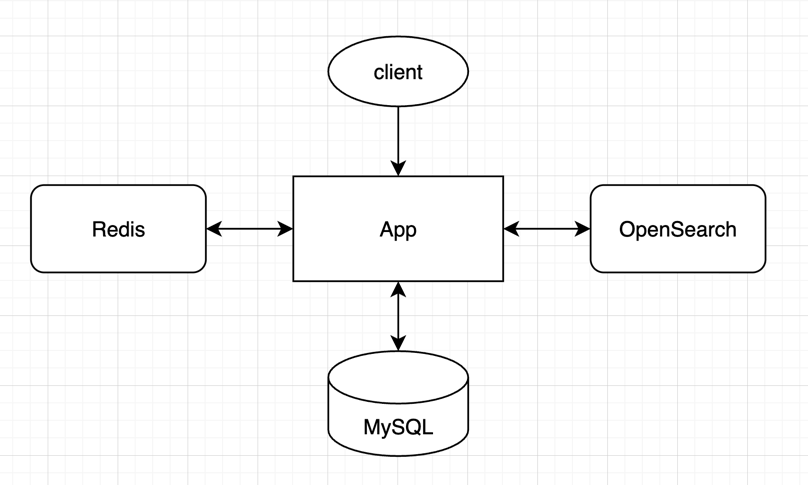

# 아키텍처 설계

### 1. 개요
- 프로젝트의 전체 기술 구조와 주요 구성 요소를 정의
- 서비스의 확장성, 안정성, 유지보수성을 고려하여 설계

### 2. 시스템 구성도

- App: API 요청 처리
- MySQL: 정형 데이터 저장소
- Redis: 캐시 및 세션 관리
- OpenSearch: 검색 및 통계 처리

### 3. 구성 요소별 설명

| 구성 요소                     | 역할                             | 비고                                                      |
|---------------------------|--------------------------------|---------------------------------------------------------|
| Application (Spring Boot) | REST API 서버, 요청/응답 처리          | JWT 인증, Controller-Service-Repository 구조, JPA 기반 데이터 접근 |
| MySQL                     | 정형 데이터 저장 (회원, 게시글, 댓글, 좋아요 등) |                                                         |
| Redis                     | 캐시 (조회수, 인기글, 세션 관리)           |                                                         |
| OpenSearch                | 검색 및 통계 집계                     |                                                         |
| Elastic APM Server (예정)   | 트랜잭션 추적, 성능/에러 모니터링            |                                                         |
| AWS EC2                   | 애플리케이션 실행 환경                   | Docker 기반                                               |
| GitHub Actions            | CI/CD 자동 배포 파이프라인              |                                                         |
| AWS ECR                   | Docker 이미지 저장소                 | GitHub Actions에서 빌드된 이미지를 푸시 후, EC2에서 Pull & Run        |
| S3 (예정)                   | 이미지 및 첨부파일 저장소                 |                                                         |

### 4. 요청 처리 흐름
- 주요 시나리오별 요청 처리 흐름을 설명

##### - 회원가입
    1. 사용자가 `/api/v1/users`로 회원가입 요청을 전송
    2. Application이 입력 데이터(eamil, password, nickname) 검증
    3. 비밀번호 BCrypt 등 해시 알고리즘으로 암호화
    4. 중복 이메일/닉네임 여부를 MySQL에서 조회
    5. 유효한 경우 MySQL에 저장
    6. 회원가입 성공 응답(201 Created) 반환

##### - 로그인
    1. 사용자가 `/api/v1/auth/login`으로 로그인 요청을 전송
    2. Application이 입력 데이터(eamil, password) 검증
    3. MySQL에서 이메일을 기준으로 회원 정보 조회
    4. 조회된 회원의 비밀번호 검증(BCrypt 등)
    5. 유효한 경우 JWT Access/Refresh 토큰 발급
    6. 해당 사용자 Refresh 토큰 및 정보를 Redis에 저장
    7. 로그인 성공 응답(200 OK)과 함께 토큰을 헤더에 포함하여 반환

##### - 로그아웃
    1. 사용자가 `/api/v1/auth/logout`으로 로그아웃 요청을 전송
    2. Application이 Authorization 헤더의 Access 토큰 검증
        - 만료된 토큰은 허용, 위조된 토큰은 401로 차단
    3. 해당 사용자의 정보를 Redis에서 조회하여 세션을 삭제
    4. 서버는 응답 시 Authorization 및 Refresh 헤더를 빈 값으로 설정하여 반환
    5. 로그아웃 성공 응답(204 No Content) 반환

##### - 게시글 목록 조회
    1. 사용자가 `/api/v1/posts`로 게시글 목록 조회 요청을 전송
    2. Redis에서 캐시 데이터 확인
    3. 캐시가 존재하면 Redis 데이터 반환
    4. 캐시가 존재하지 않는 경우, MySQL에서 게시글 목록을 조회
    5. 조회된 게시글 목록을 Redis에 캐싱
    6. 게시글 목록 조회 성공 응답(200 OK)과 함께 게시글 목록 반환

##### - 게시글 상세 조회
    1. 사용자가 `/api/v1/posts/{postId}`로 게시글 상세 조회 요청을 전송
    2. Redis 캐시에 해당 게시글이 존재하는지 확인
    3. 캐시가 존재하면 캐시 데이터를 반환하고, 별도의 비동기 처리로 조회수를 증가
    4. 캐시가 존재하지 않으면, MySQL에서 게시글 상세 정보 조회
    5. MySQL 조회 시 조회수를 +1 증가
    6. 조회된 게시글 정보를 Redis에 캐싱
    7. 게시글 상세 조회 성공 응답(200 OK)과 함께 게시글 상세 정보 반환

##### - 게시글 작성
    1. 사용자가 `/api/v1/posts`로 게시글 작성 요청을 전송
    2. Application이 입력 데이터(title, content) 검증
    3. 유효한 경우 MySQL 저장
    4. Redis 캐시 무효화
        - 기존 게시글 목록 캐시 삭제
        - 새 개시글 포함된 목록 DB에서 다시 조회
    5. OpenSearch에 새 게시글을 검색 인덱스에 추가
    6. 게시글 작성 성공 응답(201 Created) 반환

##### - 게시글 수정/삭제
    1. 사용자가 `/api/v1/posts/{postId}`로 게시글 수정 또는 삭제 요청을 전송
    2. Application이 요청자의 게시글 소유 여부 검증
    3. 유효한 경우 MySQL deleted_at 업데이트
    3. Redis 캐시 삭제
    4. OpenSearch 인덱스 갱신
    5. 게시글 수정 또는 삭제 응답 반환

##### - 게시글 검색
    1. 사용자가 `/api/v1/posts?query={keyword}`로 검색 요청을 전송
    2. Application이 검색 키워드(query) 유효성 검증
    3. OpenSearch에서 인덱스를 대상으로 검색 수행
        - title, content, nickname 필드에서 multi-match query 실행
        - 검색 결과는 점수(_score) 순으로 정렬
    4. OpenSearch 검색 결과를 매핑하여 API 응답 포맷으로 변환
    5. 게시글 검색 응답(200 OK)과 함께 검색 결과를 반환

##### - 게시글 좋아요
    1. 사용자가 `/api/v1/posts/{postId}/like`로 게시글 좋아요 요청 전송
    2. Application이 로그인 사용자 정보(JWT) 검증
    3. Redis에 해당 게시글의 좋아요 상태 저장
    4. 비동기 배치 또는 스케줄러를 통해 Redis 데이터 -> MySQL 데이터 반영
    5. 게시글 좋아요 성공 응답(201 Created) 반환

##### - 인기글 집계
    1. 매일 새벽 3시에 Spring Batch 또는 스케줄러 실행
    2. 배치 작업이 Redis에서 view_count 전체 스캔
    3. 각 게시글 조회수를 MySQL에 누적 업데이트
    4. MySQL에 반영 후 Redis에 view_count 데이터 삭제
    5. MySQL에 반영된 조회수를 기준으로 인기글 목록 계산 및 Redis에 캐싱

### 5. 배포 아키텍서
- 빌드 및 배포 흐름
  - GitHub Actions -> Docker 이미지 빌드 -> AWS ECR Push -> EC2 Pull & Run

### 6. 확장 계획
- 인증 서버 분리 (MSA)
- APM Server 및 APM Agent 추가
- APM 알람 Slack 연동 (Slack 외 다른 서비스로 변경 가능)
- OpenSearch 기반 통계 분석
- 이미지 업로드 및 CDN 적용
- Redis Cluster / RDS Read Replica 도입 (트래픽 분산 및 고가용성 확보)
