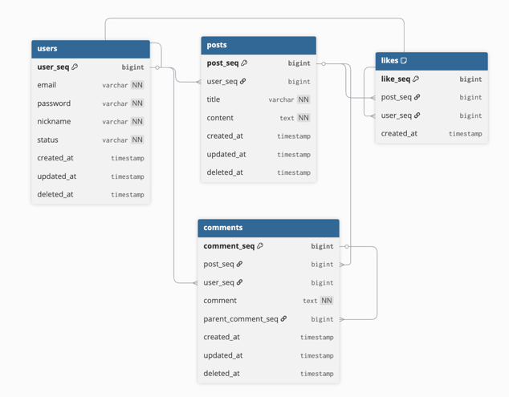

# 데이터베이스 설계

### 1. 개요
블로그 서비스의 데이터베이스 설계를 정의<br>
주요 엔티티는 회원(users), 게시글(posts), 댓글(comments), 좋아요(likes)로 구성

### 2. ERD


- DBML 정의
```dbml
Table users {
  user_seq bigint [pk, increment] // 회원 순번 pk
  email varchar [unique, not null] // 이메일 (아이디)
  password varchar [not null] // 비밀번호
  nickname varchar [not null] // 닉네임
  status varchar [not null] // 상태 (active, inactive)
  created_at timestamp
  updated_at timestamp
  deleted_at timestamp
}

Table posts {
  post_seq bigint [pk, increment] // 게시글 순번 pk
  user_seq bigint [ref: > users.user_seq] // 회원 순번 fk
  title varchar [not null] // 제목
  content text [not null] // 내용
  created_at timestamp
  updated_at timestamp
  deleted_at timestamp
}

Table comments {
  comment_seq bigint [pk, increment] // 댓글 순번 pk
  post_seq bigint [ref: > posts.post_seq] // 게시글 순번 fk
  user_seq bigint [ref: > users.user_seq] // 회원 순번 fk
  comment text [not null] // 댓글 
  parent_comment_seq bigint [ref: > comments.comment_seq, null] // 부모 댓글 fk (대댓글)
  created_at timestamp
  updated_at timestamp
  deleted_at timestamp
}

Table likes {
  like_seq bigint [pk, increment] // 좋아요 순번 pk
  post_seq bigint [ref: > posts.post_seq] // 게시글 순번 fk
  user_seq bigint [ref: > users.user_seq] // 회원 순번 fk
  created_at timestamp

  indexes {
    (post_seq, user_seq) [unique]
  }
}
```

### 3. DB 논리 설계
```mysql
-- 회원 테이블
CREATE TABLE users (
    user_seq BIGINT AUTO_INCREMENT PRIMARY KEY COMMENT '회원 순번',
    email VARCHAR(100) NOT NULL UNIQUE COMMENT '이메일(아이디)',
    password VARCHAR(255) NOT NULL COMMENT '비밀번호',
    nickname VARCHAR(50) NOT NULL COMMENT '닉네임',
    status ENUM('active', 'inactive') NOT NULL DEFAULT 'active' COMMENT '상태',
    created_at TIMESTAMP DEFAULT CURRENT_TIMESTAMP COMMENT '등록일시',
    updated_at TIMESTAMP DEFAULT CURRENT_TIMESTAMP ON UPDATE CURRENT_TIMESTAMP COMMENT '수정일시',
    deleted_at TIMESTAMP NULL COMMENT '삭제일시'
);

-- 게시글 테이블
CREATE TABLE posts (
    post_seq BIGINT AUTO_INCREMENT PRIMARY KEY COMMENT '게시글 순번',
    user_seq BIGINT NOT NULL COMMENT '회원 순번',
    title VARCHAR(200) NOT NULL COMMENT '제목',
    content TEXT NOT NULL COMMENT '내용',
    created_at TIMESTAMP DEFAULT CURRENT_TIMESTAMP COMMENT '등록일시',
    updated_at TIMESTAMP DEFAULT CURRENT_TIMESTAMP ON UPDATE CURRENT_TIMESTAMP COMMENT '수정일시',
    deleted_at TIMESTAMP NULL COMMENT '삭제일시',
    CONSTRAINT fk_posts_user FOREIGN KEY (user_seq) REFERENCES users(user_seq) ON DELETE CASCADE
);

-- 댓글 테이블
CREATE TABLE comments (
    comment_seq BIGINT AUTO_INCREMENT PRIMARY KEY COMMENT '댓글 순번',
    post_seq BIGINT NOT NULL COMMENT '게시글 순번',
    user_seq BIGINT NOT NULL COMMENT '회원 순번',
    comment TEXT NOT NULL COMMENT '댓글 내용',
    parent_comment_seq BIGINT NULL COMMENT '부모 댓글 순번(대댓글)',
    created_at TIMESTAMP DEFAULT CURRENT_TIMESTAMP COMMENT '등록일시',
    updated_at TIMESTAMP DEFAULT CURRENT_TIMESTAMP ON UPDATE CURRENT_TIMESTAMP COMMENT '수정일시',
    deleted_at TIMESTAMP NULL COMMENT '삭제일시',
    CONSTRAINT fk_comments_post FOREIGN KEY (post_seq) REFERENCES posts(post_seq) ON DELETE CASCADE,
    CONSTRAINT fk_comments_user FOREIGN KEY (user_seq) REFERENCES users(user_seq) ON DELETE CASCADE,
    CONSTRAINT fk_comments_parent FOREIGN KEY (parent_comment_seq) REFERENCES comments(comment_seq) ON DELETE SET NULL
);

-- 좋아요 테이블
CREATE TABLE likes (
    like_seq BIGINT AUTO_INCREMENT PRIMARY KEY COMMENT '좋아요 순번',
    post_seq BIGINT NOT NULL COMMENT '게시글 순번',
    user_seq BIGINT NOT NULL COMMENT '회원 순번',
    created_at TIMESTAMP DEFAULT CURRENT_TIMESTAMP COMMENT '등록일시',
    CONSTRAINT fk_likes_post FOREIGN KEY (post_seq) REFERENCES posts(post_seq) ON DELETE CASCADE,
    CONSTRAINT fk_likes_user FOREIGN KEY (user_seq) REFERENCES users(user_seq) ON DELETE CASCADE,
    CONSTRAINT uq_likes UNIQUE (post_seq, user_seq)
);
```

### 4. 관계 설명
| 관계                  | 설명                          |
|-----------------------|-------------------------------|
| users : posts         | 1 : N (회원이 여러 게시글 작성 가능) |
| users : comments      | 1 : N (회원이 여러 댓글 작성 가능)  |
| posts : comments      | 1 : N (게시글에 여러 댓글 작성 가능) |
| users : likes         | 1 : N (회원이 여러 좋아요 가능)     |
| posts : likes         | 1 : N (게시글에 여러 좋아요 가능)   |
| users : posts (likes) | N : M (회원과 게시글은 좋아요를 통해 다대다 관계) |

